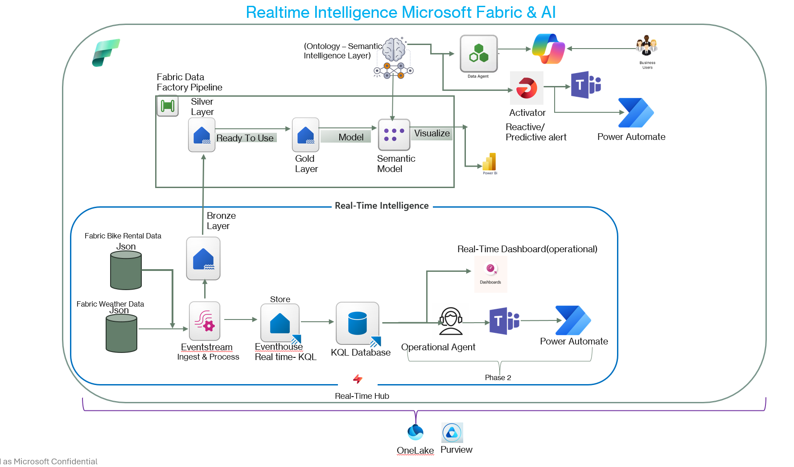

# Bicycle Real-Time Intelligence — Hackathon Demo

A **complete, one-click deployable** Real-Time Intelligence (RTI) solution on Microsoft Fabric. This repo packages 28 Fabric items (21 automated + 7 post-deploy) — from streaming eventstreams to ontology-backed AI agents — into a self-contained project that any teammate can deploy to their own workspace in under 15 minutes.

---

## Table of Contents

1. [The Problem](#the-problem)
2. [Why This Matters — Real-World Challenges](#why-this-matters--real-world-challenges)
3. [Our Solution — Fabric RTI + Medallion ETL](#our-solution--fabric-rti--medallion-etl)
4. [Solution Overview](#solution-overview)
5. [Architecture](#architecture)
6. [Task Flow](#task-flow)
7. [Quick Start — Deploy in 7 Steps](#quick-start--deploy-in-7-steps)
   - [Tenant-Level Prerequisites](#tenant-level-prerequisites-admin-required)
8. [Post-Deployment Steps](#post-deployment-steps)
   - [KQL Database Tables (Auto-Created)](#kql-database-tables-auto-created)
9. [Item Inventory](#item-inventory)
10. [Activator / Reflex Setup](#activator--reflex-items-manual-setup)
11. [Data Model](#data-model)
12. [Notebooks Reference](#notebooks-reference)
13. [Pipeline](#pipeline)
14. [Semantic Models](#semantic-models)
15. [Data Agents](#data-agents)
16. [Real-Time Components](#real-time-components)
17. [Task Flow Import](#task-flow-import)
18. [Alternative — Local Python Scripts](#alternative--local-python-scripts)
19. [Repo Structure](#repo-structure)
20. [Troubleshooting](#troubleshooting)
21. [License](#license)

---

## The Problem

> **Real-world operations move in minutes, but decisions still happen on yesterday's data.**

Bike-sharing systems are booming in cities worldwide — London alone operates **800+ docking stations** serving millions of rides per year. Yet behind the scenes, operators face the same painful cycle every single day:

🚲 **Stations run empty** — riders arrive, find zero bikes, and leave frustrated. Every empty station is a missed ride, a lost fare, and a hit to customer satisfaction. During morning rush hour in London, popular stations like Waterloo or King's Cross can drain completely within 15 minutes.

🚛 **Trucks dispatched to wrong locations** — rebalancing vans carry bikes from full stations to empty ones, but dispatchers rely on stale spreadsheets or gut instinct. A truck sent to the wrong neighbourhood wastes 30-45 minutes of crew time, fuel, and road capacity — while the actual problem station stays empty.

🌧️ **Weather shifts demand — but no one acts until it's too late** — a sudden rainstorm can cut cycling demand by 40-60% in minutes. Conversely, an unexpected sunny afternoon drives demand spikes that overwhelm stations near parks and riverfronts. Operators only discover this after the fact, buried in next-day reports.

📋 **Reports arrive 24 hours later** — traditional BI dashboards refresh overnight. By the time a manager sees that Station X was critically empty yesterday at 8:30 AM, the same problem has already repeated this morning. Decisions are made on yesterday's data for today's problems.

### This Problem Is Universal

While this project is set in **London** (using real TfL Santander Cycles station data and Open-Meteo weather feeds), the underlying challenge applies to **any city, any fleet, any real-time operation**:

| City | System | Stations | Same Problems |
|------|--------|----------|---------------|
| London | Santander Cycles | 800+ | Empty stations during rush, weather-driven demand swings |
| New York | Citi Bike | 1,700+ | Rebalancing trucks can't keep up with commuter surges |
| Paris | Vélib' | 1,400+ | Morning/evening asymmetry leaves residential stations full, business districts empty |
| Barcelona | Bicing | 500+ | Tourist demand is weather-dependent and unpredictable |
| Toronto | Bike Share | 600+ | Seasonal extremes make static schedules useless |

The data changes. The pain stays the same: **you can't fix what you can't see in real time.**

---

## Why This Matters — Real-World Challenges

Bike-sharing operations sit at the intersection of several hard data problems:

### 1. Demand Is Hyper-Local and Hyper-Temporal

A station outside a train terminal behaves completely differently from one in a residential neighbourhood. Demand varies by:
- **Hour** — morning rush (07:00–09:00) vs. lunch vs. evening commute vs. late night
- **Day type** — weekday commuting patterns vs. weekend leisure rides
- **Season** — summer peaks can be 3-4x winter baselines
- **Weather** — rain, wind, temperature, and "feels-like" comfort all shift behaviour
- **Events** — football matches, concerts, and public holidays create unpredictable surges

No static report can capture this. You need **streaming data + ML forecasting + real-time alerting**.

### 2. Weather Is the Invisible Multiplier

Weather doesn't just affect whether people ride — it changes *where* and *when* they ride:

| Weather Condition | Impact on Demand | Operational Effect |
|-------------------|-----------------|--------------------|
| Heavy rain | -40% to -60% demand | Bikes pile up at destinations; origins stay full |
| Wind > 30 km/h | -20% to -35% demand | Leisure riders vanish; commuters still ride |
| Sudden sunshine after rain | +25% spike within 30 min | Stations near parks drain instantly |
| Temperature < 5°C | -30% baseline | Rebalancing trucks sit idle; waste of crew hours |
| Heat wave > 30°C | +15% tourism, -10% commuting | Demand shifts from business zones to waterfront |

Integrating weather data in real time — not as a next-day footnote — transforms reactive firefighting into **proactive fleet positioning**.

### 3. Rebalancing Is Expensive and Time-Sensitive

Every rebalancing truck run costs £15–£25 in direct costs (fuel, crew, wear). London's system may run **hundreds of truck dispatches per day**. If even 20% are suboptimal (wrong station, wrong time, wrong quantity), that's thousands of pounds wasted weekly.

The difference between a good rebalancing decision and a bad one is often **15 minutes of data freshness**. A report that's one hour stale is already too late.

### 4. Customer Experience Degrades Silently

Unlike a crashed website that triggers immediate alarms, an empty bike station just... sits there. Riders walk away. They don't file tickets — they just stop using the service. The operator sees a slow decline in ridership months later and can't pinpoint why.

Real-time station monitoring with automatic alerting catches these silent failures **as they happen**, not after the damage is done.

---

## Our Solution — Fabric RTI + Medallion ETL

This project solves every problem above using **Microsoft Fabric's Real-Time Intelligence** capabilities combined with a classic **Medallion Architecture** ETL pipeline:

```
  THE PROBLEM                          OUR SOLUTION
  ─────────────────────                ─────────────────────────────────────
  Stations run empty         ──────▶   Real-time availability monitoring
                                       via Eventstream + KQL Dashboard
                                       (seconds latency, not hours)

  Trucks go to wrong places  ──────▶   ML demand forecasting (Prophet)
                                       + priority-scored rebalancing
                                       recommendations per station

  Weather shifts demand      ──────▶   Live Open-Meteo weather feed
                                       joined to station data in Silver
                                       layer → cycling comfort index
                                       → weather-adjusted demand scores

  Reports arrive too late    ──────▶   Hot path: KQL Dashboard (seconds)
                                       Warm path: Direct Lake PBI (minutes)
                                       Alert path: Reflex → Teams (seconds)

  Can't ask questions        ──────▶   AI Data Agents with natural language
  about the data                       queries across SQL, DAX, and Graph
```

### How the Layers Work Together

| Layer | What It Does | Fabric Items | Latency |
|-------|-------------|-------------|--------|
| **Streaming Ingest** | Captures live bike station events + weather observations every 60 seconds | 2 Eventstreams, 1 Eventhouse, 1 KQL Database | **Seconds** |
| **Bronze (Raw)** | Stores raw JSON as-is for auditability and replay | 3 Lakehouses (bike, weather, bronze) | Minutes |
| **Silver (Clean)** | Deduplicates, validates, enriches with weather joins, adds time/date dimensions | Notebooks 03, 03a | Minutes |
| **Gold (Star Schema)** | 12 fact + dimension tables optimized for analytics; ML forecast outputs; station snapshots | Notebook 04, 06 | Minutes |
| **Semantic Layer** | 2 Semantic Models (Direct Lake) with 47+ DAX measures for self-service BI | Bicycle RTI Analytics, Bicycle Ontology Model | Refresh |
| **Ontology + Graph** | 12 entity types, 23 relationships — enables graph traversals and neighbourhood-scoped reasoning | Ontology, Graph Model | Refresh |
| **AI Agents** | Natural language interface: "Which stations need rebalancing?" routes to SQL/DAX/GQL automatically | 2 Data Agents + 1 Operations Agent | On-demand |
| **Alerts** | Reflex/Activator fires when utilization drops below threshold → Power Automate → Teams notification | 2 Reflexes | **Seconds** |

### What Makes This Different from a Standard BI Project

| Traditional Approach | This Project |
|---------------------|-------------|
| Nightly batch refresh | Streaming ingest every 60 seconds |
| Single Power BI report | Hot path (KQL) + warm path (PBI) + AI agents |
| No weather integration | Live weather feed with cycling comfort index |
| Manual rebalancing decisions | ML-scored priority recommendations per station |
| Static entity lookup | Ontology-backed graph model with 23 relationship traversals |
| Email-based alerts (if any) | Reflex → Power Automate → Teams in seconds |
| Ask an analyst | Ask the AI Agent in natural language |

### Built for London — Works Anywhere

The project uses **London Santander Cycles** station data and **Open-Meteo** weather APIs, but the architecture is location-agnostic:

- **Swap the station feed** — point the Eventstream at any GBFS-compliant bike-share API (Citi Bike, Vélib', Bicing, etc.)
- **Swap the weather feed** — Open-Meteo covers the entire globe; just change the lat/lon coordinates
- **Same medallion pipeline** — Bronze/Silver/Gold notebooks parameterize by station ID and location
- **Same ontology structure** — entity types (Station, Neighbourhood, WeatherObservation, etc.) are universal
- **Same agents** — the Data Agent instructions work with any city's data once the schema is populated

> **Bottom line:** This isn't just a London bike demo. It's a **reusable pattern** for any real-time fleet intelligence scenario — scooters, delivery vans, EV chargers, transit vehicles — wherever operations need to move faster than yesterday's report.

---

## Solution Overview

This project demonstrates a **full Real-Time Intelligence scenario** built on Microsoft Fabric. A fictional bike-sharing operator ("Bicycle Fleet") deploys sensor-equipped bikes across London. The solution:

- **Ingests** real-time bike station availability and live weather data via Eventstreams
- **Processes** data through a **Medallion Architecture** (Bronze → Silver → Gold)
- **Forecasts** hourly demand using ML models (Prophet / scikit-learn)
- **Models** fleet entities via an **Ontology** with 12 entity types and 23 relationship types
- **Visualizes** operations through a KQL Dashboard (hot-path) and Power BI Report (warm-path)
- **Reasons** over data using two **AI Data Agents** (natural language SQL + graph-backed ontology queries)
- **Activates** alerts through **Reflex/Activators** → Power Automate → Microsoft Teams

**Key Fabric capabilities demonstrated:**  
Lakehouse, Eventhouse, KQL Database, Eventstream, Notebook (PySpark), Data Pipeline, Semantic Model (Direct Lake), Report (PBIR), KQL Dashboard, Data Agent, Ontology, Graph Model, Reflex/Activator, ML Experiment

---

## Architecture

### Medallion Architecture


### Real-Time Intelligence Architecture


<details>
<summary>Text-based architecture diagram</summary>

```
 ┌───────────────────────────────────────────────────────────────────────────────┐
 │                     Microsoft Fabric — "Bike Rental Hackathon" Workspace      │
 │                                                                               │
 │  ┌─────────────────┐        ┌───────────────┐                                │
 │  │  RTIbikeRental   │──┬───▶│  Eventhouse    │──▶ KQL Dashboard               │
 │  │  (Eventstream)   │  │    │  bikerental-   │    (Live Operations)            │
 │  └─────────────────┘  │    │  eventhouse     │                                │
 │                        │    └───────────────┘                                │
 │  ┌─────────────────┐  │                                                      │
 │  │  RTI-WeatherDemo │──┤                                                      │
 │  │  (Eventstream)   │  │                                                      │
 │  └─────────────────┘  │                                                      │
 │                        │    MEDALLION ARCHITECTURE                            │
 │                        │    ┌──────────┐  ┌──────────┐  ┌──────────┐         │
 │                        └───▶│  BRONZE   │─▶│  SILVER  │─▶│   GOLD   │         │
 │                             │  bikerental│  │  bicycles│  │  bicycles│         │
 │                             │  _bronze   │  │  _silver │  │  _gold   │         │
 │                             │  _raw      │  │          │  │          │         │
 │                             └──────────┘  └──────────┘  └────┬─────┘         │
 │                                                               │               │
 │                     ┌─────────────────────────────────────────┤               │
 │                     │                    │                    │               │
 │               ┌─────▼──────┐      ┌─────▼──────┐      ┌─────▼──────┐        │
 │               │  Analyze & │      │  Ontology   │      │  Realtime  │        │
 │               │    Train   │      │  12 entities │      │ Activation │        │
 │               │  (ML, KQL) │      │  23 rels     │      │ (Reflex)   │        │
 │               └─────┬──────┘      └─────┬──────┘      └─────┬──────┘        │
 │                     │                    │                    │               │
 │               ┌─────▼──────┐      ┌─────▼──────┐      ┌─────▼──────┐        │
 │               │  Semantic  │      │  Data Agent │      │  Power     │        │
 │               │  Models(2) │      │  (3 agents) │      │  Automate  │        │
 │               └─────┬──────┘      └────────────┘      └─────┬──────┘        │
 │                     │                                        │               │
 │               ┌─────▼──────┐                           ┌─────▼──────┐        │
 │               │  PBI Report│                           │  Teams     │        │
 │               │  (PBIR)    │                           │  Alerts    │        │
 │               └────────────┘                           └────────────┘        │
 └───────────────────────────────────────────────────────────────────────────────┘
```

</details>

### Data Flow Summary

| Path | Flow | Latency |
|------|------|---------|
| **Hot path** | Eventstream → Eventhouse → KQL Dashboard | Seconds |
| **Warm path** | Eventstream → Bronze → Silver → Gold → Semantic Model → PBI Report | Minutes (pipeline) |
| **ML path** | Gold → Demand Forecast (Prophet / sklearn) → Gold tables | Pipeline run |
| **Ontology path** | Gold → Ontology entity tables → Graph Model → Data Agent | Pipeline run |
| **Alert path** | Eventstream → Reflex/Activator → Power Automate → Teams | Seconds |

---

## Task Flow

The Fabric **Task Flow** provides a visual overview of how all items relate in the workspace. This project includes a pre-built task flow definition matching the architecture above.

<details>
<summary><strong>Task Flow View (15 tasks, 15 connectors)</strong></summary>

| Task | Type | Items |
|------|------|-------|
| Raw streaming Bike Rentals | Get data | RTIbikeRental |
| Raw Streaming Weather | Get data | RTI-WeatherDemo |
| Eventhouse | Store data | bikerentaleventhouse |
| RTI Dashboard | Visualize data | KQL Dashboard |
| Bronze data | Store data | 2 Lakehouses, NB02, NB03a |
| Silver data | Store data | 1 Lakehouse, NB03, NB03a |
| Golden data | Store data | 1 Lakehouse, NB04 |
| Analyze and train | Analyze & train | NB05, NB06, NB08 |
| Semantic Model | General | 2 Semantic Models |
| Ontology | General | Ontology, Graph Model, NB09 |
| Realtime activation | Track data | 2 Activators |
| PowerBI Dashboard | Visualize data | PBI Report |
| Data Agent | General | 3 Data Agents |
| Power Automate Connector | General | (external) |
| Teams | General | (external) |

</details>

**To import the task flow:** See [Task Flow Import](#task-flow-import) below.

---

## Quick Start — Deploy in 7 Steps

### Tenant-Level Prerequisites (Admin Required)

Before deploying, ensure your **Fabric administrator** has enabled the following features in the **Fabric Admin Portal** → **Tenant settings**:

| Feature | Required For | Admin Setting Location |
|---------|--------------|------------------------|
| **Real-Time Intelligence** | Eventstream, Eventhouse, KQL Database, KQL Dashboard | Tenant settings → Real-Time Intelligence |
| **Data Activator / Reflex** | Real-time alerts to Teams/Power Automate | Tenant settings → Data Activator |
| **Copilot and AI features** | Data Agents (natural language queries) | Tenant settings → Copilot and Azure OpenAI Service |
| **Users can create Fabric items** | Creating all Fabric items | Tenant settings → Users can create Fabric items |
| **ArcGIS Maps** | Map visualizations in KQL Dashboard | Tenant settings → Integration settings → ArcGIS Maps for Power BI |
| **Graph Model (Preview)** | Ontology knowledge graph traversals | May require preview feature enrollment |

> **How to check:** Ask your Fabric admin to navigate to **admin.powerbi.com** → **Tenant settings** and verify each setting is enabled for your security group or the entire organization.
>
> **Common symptom if disabled:** Features appear grayed out, items fail to create, or you see "This feature is not enabled for your organization" errors.

### Prerequisites

- A Fabric workspace with **F64 or higher** capacity
- **Contributor** or higher permissions on the workspace
- Willingness to create a **temporary `deploy_staging` Lakehouse** (explained below — deleted after deployment)

> **Choose your deployment path:**
>
> | Path | Best for | Auth needed |
> |------|----------|-------------|
> | **Path A: Fabric Notebook** (recommended) | Teams, shared environments | None — already signed in |
> | **Path B: Local Python** | CLI users, automation | Browser sign-in once |

---

### Path A: Fabric Notebook (Recommended — No Extra Auth)

#### Step 1: Clone the repo to your local machine

```bash
git clone https://github.com/kwamesefah_microsoft/RTI-Hackathon-Demo.git
```

#### Step 2: Create a staging Lakehouse and upload files

> **Why do I need `deploy_staging`?**
>
> Fabric notebooks **require a default lakehouse attached** to run Python/PySpark cells. The deployment notebooks read item definition files from the lakehouse's `Files/` area. You can't use one of the project lakehouses (e.g. `bikerental_bronze_raw`) because **those don't exist yet** — they are the items being deployed. So you create a temporary lakehouse, upload the repo files into it, attach it to both deployment notebooks, and delete it when you're done.

1. In your Fabric workspace, create a new **Lakehouse** — name it **`deploy_staging`**
2. Open it → click **Upload → Upload folder**
3. Upload the **`workspace`** folder from the cloned repo (contains ~26 item definition sub-folders for `fabric-cicd`)
4. Upload the **`post_deploy`** folder the same way (contains JSON definitions for Ontology, Graph Model, Agents, and Activators — used by `Post_Deploy_Setup.ipynb` in Step 6)
5. Upload the **`sample_data`** folder (contains `dim_customers.csv` for customer analytics)
6. Wait for uploads — you should see:
   - `Files/workspace/` with ~26 sub-folders (one per item)
   - `Files/post_deploy/definitions/` with the REST API payload files
   - `Files/sample_data/dim_customers.csv`

#### Step 3: Upload and run the deploy notebook

1. Upload `Deploy_Bicycle_RTI.ipynb` from the cloned repo to your workspace
2. Open it → **attach** the `deploy_staging` lakehouse from Step 2 (left sidebar → Add lakehouse → select `deploy_staging`). The notebook reads item definitions from the lakehouse's `Files/workspace/` folder.
3. Run **Cell 1** — installs `fabric-cicd` (ignore pip warnings)
4. Run **Cell 2** — deploys all 23 items in 5 staged rounds. No GitHub, no PAT, no auth prompts.
5. Run **Cell 3** — auto-fixes KQL Dashboard query URI + removes broken Pipeline SM refresh activity
6. Run **Cell 4** — validates all items were created

#### Step 4: Start Eventstreams (data must flow first)

The eventstreams feed the **Bronze layer** — nothing downstream works without them.

1. Open **RTIbikeRental** Eventstream → confirm it's running (click **Start** if not)
2. Open **RTI-WeatherDemo** Eventstream → confirm it's running (click **Start** if not)
3. If destinations show **"Error found"**, click **Edit** → **Publish** to refresh the connections — the errors should clear
4. **Wait until you see data arriving** — open a Bronze Lakehouse and refresh; you should see rows in the tables
5. Let the streams run for 10–30 min to accumulate enough data for meaningful dashboards

> **Tip:** You can pause/stop the eventstreams once you have enough data to save capacity. Restart them anytime.

#### Step 5: Run the pipeline (Medallion processing)

The pipeline processes Bronze → Silver → Gold → ML → Ontology. **It requires Bronze data from Step 4.**

1. Open **PL_BicycleRTI_Medallion** in the workspace
2. Click **Run** (~15–25 minutes)
3. After pipeline completes, **manually refresh** both Semantic Models:
   - Open each model → click **Refresh now**
   - (Cell 3 removed the auto-refresh pipeline activity because it needs a connection that can't be created programmatically)

#### Step 6: Deploy Ontology + Graph + Operations Agent + DataAgents + Activators

> ⚠️ **IMPORTANT: Stop the Spark session from `Deploy_Bicycle_RTI.ipynb` before running this notebook!**
>
> If the Spark session from Step 3 is still running, you will hit a Spark compute rate limit:
> ```
> This spark job can't be run because you have hit a spark compute or API rate limit.
> HTTP status code: 430
> ```
> **To fix:** Open `Deploy_Bicycle_RTI.ipynb` → click **Stop session** in the notebook toolbar (or wait for it to auto-terminate after ~20 min idle). Then run `Post_Deploy_Setup.ipynb`.

> **Pre-requisite:** The `post_deploy/` folder must already be uploaded to the `deploy_staging` lakehouse (Step 2, item 4). The notebook reads definition JSON files from `Files/post_deploy/definitions/`.

Upload `Post_Deploy_Setup.ipynb` to your workspace, **attach `deploy_staging`** (same as Step 3), and **Run all cells**. This creates all 7 post-deploy items:
- **Bicycle_Ontology_Model_New** — Ontology with 12 entity types, 23 relationship types
- **Bicycle_Ontology_Model_New_graph** — Graph Model linked to bicycles_gold lakehouse
- **Cycling-Campaign-Agent** — Operations Agent for campaign automation
- **Bicycle Fleet Data Agent** — Data Agent wired to bicycles_gold + Ontology semantic model
- **Bicycle Ontology Data Agent** — Data Agent wired to Ontology semantic model
- **BicycleFleet_Activator** — Reflex Activator for fleet alerts (connect to RTIbikeRental eventstream after deploy)
- **Cycling Campaign Activator** — Reflex Activator for campaign triggers

> **Re-run notes:**
> - If you re-upload the notebook after a kernel restart, **run Cell 1 first** to re-establish shared variables (`items`, `ws_id`, `headers`, etc.).
> - **Cells 2 & 3** (Ontology, Graph Model) are idempotent — safe to re-run.
> - **Cell 4** (Operations Agent) may return a 500 on first attempt but still creates the agent asynchronously. If you see `ItemDisplayNameNotAvailableYet`, **do NOT re-run** — wait 2–3 minutes and check the workspace. The agent's KQL datasource may need manual configuration in the Fabric UI (point it to `bikerentaleventhouse`).
> - **Cell 3** (Graph Model) deletes the auto-provisioned companion graph and creates a standalone graph with the full definition. This is by design — see [Why a Standalone Graph Model?](#why-a-standalone-graph-model) below.

After `Post_Deploy_Setup.ipynb` completes, the Graph Model should show nodes & edges automatically. If it still shows 0, open the Graph Model in Fabric UI → click **Refresh now**.

#### Step 7: Verify everything is working

| Action | Where | Time |
|--------|-------|------|
| Open KQL Dashboard → confirm tiles show Eventhouse data | Fabric UI | 2 min |
| Test the Data Agent → ask *"Which stations need rebalancing?"* | Fabric UI | 1 min |
| Delete the `deploy_staging` lakehouse | Fabric UI | 1 min |

#### You're done! 🎉

See [AGENT_SAMPLE_QUESTIONS.md](AGENT_SAMPLE_QUESTIONS.md) for 52 tested questions to try with the Data Agent.

---

### Path B: Local Python (Alternative)

If you prefer deploying from your local machine:

```bash
git clone https://github.com/kwamesefah_microsoft/RTI-Hackathon-Demo.git
cd RTI-Hackathon-Demo
pip install -r requirements.txt
python deploy.py
```

You'll be prompted for your workspace ID or name, then a browser window opens for Microsoft sign-in. After that, follow Steps 4–7 from Path A above.

---

## Post-Deployment Steps

After `Deploy_Bicycle_RTI.ipynb` (Cells 1–4) completes:

### Automated (via Post_Deploy_Setup.ipynb)

The `Post_Deploy_Setup.ipynb` notebook programmatically deploys 3 items that `fabric-cicd` doesn't support:

| Item | API Used | What It Does |
|------|----------|--------------|
| **Bicycle_Ontology_Model_New** | `POST /ontologies` + `updateDefinition` | Creates ontology, loads 75 definition parts (12 entity types, 12 data bindings, 23 relationships, 23 contextualizations), patches workspace/lakehouse GUIDs |
| **Bicycle_Ontology_Model_New_graph** | `DELETE` companion + `POST /graphModels` + `refreshGraph` | Deletes the read-only companion, creates a standalone graph with full 4-part definition, and triggers refresh. See [Why a Standalone Graph Model?](#why-a-standalone-graph-model) |
| **Cycling-Campaign-Agent** | `POST /items` | Creates operations agent with campaign instructions |

> **Ontology REST API**: The Fabric Ontology API (`/v1/workspaces/{id}/ontologies`) is documented at
> [learn.microsoft.com](https://learn.microsoft.com/en-us/rest/api/fabric/ontology/items).
> The `scripts/clients/ontology_client.py` wrapper covers create, getDefinition, updateDefinition, and delete.

> **Graph Model REST API**: The Fabric GraphModel API (`/v1/workspaces/{id}/graphModels`) is documented at
> [learn.microsoft.com](https://learn.microsoft.com/en-us/rest/api/fabric/graphmodel/items).
> The `scripts/clients/graph_client.py` wrapper covers create, getDefinition, updateDefinition, refresh, executeQuery, and getQueryableGraphType.

#### Why a Standalone Graph Model?

> **⚠️ Known Fabric Product Limitation (as of March 2026):** When an Ontology is created, Fabric auto-provisions a companion graph model. However, the companion graph is **ontology-managed and read-only via the REST API** — neither `updateDefinition` nor `refreshGraph` are supported. This means there is currently **no programmatic way** to push a graph definition or trigger a data refresh on the auto-provisioned companion. The only way to populate it is manually through the Fabric UI. This limitation affects any CI/CD or automated deployment workflow that needs to deploy a fully-populated graph model alongside an ontology.

When you create an Ontology in Fabric, the platform auto-provisions a **companion graph model** (you'll recognise it by the GUID suffix in its name, e.g. `Bicycle_Ontology_Model_New_graph_e18790af3c65…`). That companion is **ontology-managed**, which means the REST API rejects both operations:

- `updateDefinition` → the LRO completes with status **Failed**
- `refreshGraph` → returns **InvalidJobType**
- The graph stays permanently empty (0 nodes, 0 edges) because the API cannot push a definition to it

**Our workaround** in Cell 3:
1. **Delete** the companion graph (it's empty and unusable via API)
2. **Create a standalone graph model** with the same base name (`Bicycle_Ontology_Model_New_graph`) and push the full 4-part definition (graphType, dataSources, graphDefinition, stylingConfiguration)
3. **Trigger `refreshGraph`** — which works on standalone graphs — to populate nodes & edges

The standalone graph reads the **same lakehouse tables** as the ontology, so the visual experience is identical. If Microsoft adds API support for ontology-managed companion graphs in a future update, this workaround can be removed.

> **Does this affect the Data Agent?** No. The Bicycle Fleet Intelligence Agent references the **Ontology** item (`artifactId` → ontology ID), not the graph model. The ontology has its own embedded `DataBindings` and `Contextualizations` that point directly to the lakehouse. The graph model is a **separate visual explorer** for humans — same underlying lakehouse tables, different access path.
>
> ```
> Agent question → Ontology → DataBindings → bicycles_gold lakehouse
> Fabric UI      → Graph Model → dataSources → bicycles_gold lakehouse (same tables)
> ```

### Manual Steps

| Step | Action | Time |
|------|--------|------|
| **1. Start Eventstreams** | Open RTIbikeRental and RTI-WeatherDemo — click **Start** if not running. Wait for Bronze data. | 10–30 min |
| **2. Run Post-Deploy Notebook** | Upload & run `Post_Deploy_Setup.ipynb` — creates KQL tables, Ontology, Graph, Data Agents | 5 min |
| **3. Run Pipeline** | Open PL_BicycleRTI_Medallion → click **Run** (Bronze → Silver → Gold → ML → Ontology) | 15–25 min |
| **4. Refresh Semantic Models** | Open each Semantic Model → click **Refresh now** | 5 min |
| **5. Refresh Graph Model** | Cell 3 triggers `refreshGraph` automatically. If nodes/edges still show 0, open Graph Model → **Refresh now** | 2 min |
| **6. Verify KQL Dashboard** | Open KQL Dashboard → confirm tiles show data from Eventhouse | 2 min |
| **7. Test Data Agent** | Open Bicycle Fleet Intelligence Agent → ask: *"What are the top 5 busiest stations?"* | 1 min |
| **Import Task Flow** *(optional)* | See [Task Flow Import](#task-flow-import) — import `bicycle_rti_task_flow.json` | 5 min |
| **Configure Activators** *(optional)* | Create Reflex items manually, add alert triggers. See `docs/ACTIVATOR_SETUP.md` | 10 min |
| **Set up Power Automate** *(optional)* | Create flows triggered by Activator → send Teams notifications | 15 min |

### KQL Database Tables (Auto-Created)

> **✅ Now Automated:** `Post_Deploy_Setup.ipynb` Cell 1.5 automatically creates all KQL tables using the Kusto SDK. No manual copy/paste required!

**What gets created:**

| Table | Purpose | Data Source |
|-------|---------|-------------|
| `bikerentaldb` | Real-time bike station status | Eventstream (TfL API) |
| `weather_events` | Raw weather data (string booleans) | Eventstream (Open-Meteo API) |
| `weather_events_clean` | Cleaned weather data (proper types) | Auto-populated via update policy |
| `geo_station_hotspots` | Station-level Gi* hotspot analysis | Gold lakehouse (after pipeline runs) |
| `geo_neighbourhood_zones` | Neighbourhood zone risk metrics | Gold lakehouse (after pipeline runs) |
| `geo_rebalancing_routes` | Optimal rebalancing routes | Gold lakehouse (after pipeline runs) |

**How it works:**
1. Cell 1.5 discovers the Eventhouse `queryServiceUri` via Fabric REST API
2. Connects using the Kusto SDK (`azure-kusto-data`)
3. Executes `.create-merge table` commands for all 6 tables
4. Creates the `weather_events_transform()` function
5. Attaches the update policy for auto-transformation

**Manual fallback:** If Cell 1.5 fails (e.g., permissions), use `workspace/bikerentaleventhouse.KQLDatabase/POST_DEPLOYMENT_KQL_SETUP.kql` — copy/paste sections into a KQL queryset.

### Customer Data Table (Cell 1.6)

`Post_Deploy_Setup.ipynb` Cell 1.6 loads `dim_customers` into the Gold lakehouse from `Files/sample_data/dim_customers.csv`.

| Column | Type | Description |
|--------|------|-------------|
| CustomerID | String | Primary key (e.g., CUST-0001) |
| FirstName, LastName, Email | String | Contact info |
| Neighbourhood | String | Links to dim_neighbourhood |
| MembershipTier | String | Annual, Casual, Corporate |
| RiderSegment | String | Commuter, Tourist, Recreational |
| AccountStatus | String | Active, Suspended, Cancelled |
| NationalInsuranceNumber | String | PII - masked in queries |
| CreditCardLast4 | String | PII - last 4 digits only |

**Prerequisites:** Upload `sample_data/` folder to lakehouse (Step 2.5).

---

## Item Inventory

### Automated Deployment (24 items via fabric-cicd)

| # | Item | Type | Description |
|---|------|------|-------------|
| 1 | `bikerental_bronze_raw` | Lakehouse | Raw bike station data landing zone |
| 2 | `weather_bronze_raw` | Lakehouse | Raw weather data landing zone |
| 3 | `bicycles_silver` | Lakehouse | Cleaned & enriched data |
| 4 | `bicycles_gold` | Lakehouse | Star schema dimensional model |
| 5 | `bikerentaleventhouse` | Eventhouse | KQL real-time analytics store |
| 6 | `bikerentaleventhouse` | KQLDatabase | Database within the Eventhouse |
| 7 | `02_Bronze_Streaming_Ingest` | Notebook | Data quality audit & station reference (manual/diagnostic) |
| 8 | `03_Silver_Enrich_Transform` | Notebook | Clean, validate, derive columns |
| 9 | `03a_Silver_Weather_Join` | Notebook | Join weather context to bike data |
| 10 | `04_Gold_Star_Schema` | Notebook | Build fact/dim tables |
| 11 | `05_KQL_Realtime_Queries` | Notebook | KQL query patterns and examples |
| 12 | `06_ML_Demand_Forecast` | Notebook | Prophet + sklearn demand forecasting |
| 13 | `07_Activator_Alerts` | Notebook | Activator alert configuration |
| 14 | `08_GeoAnalytics_HotSpots` | Notebook | Geographic demand heat maps |
| 15 | `09_Ontology_Neighbourhood_Filter` | Notebook | Ontology table population |
| 16 | `RTIbikeRental` | Eventstream | Sample bike data → Lakehouse + Eventhouse |
| 17 | `RTI-WeatherDemo` | Eventstream | Live weather (London) → Eventhouse + Lakehouse |
| 18 | `Bicycle RTI Analytics` | SemanticModel | Direct Lake — fleet operations (10 tables) |
| 19 | `Bicycle Ontology Model` | SemanticModel | Direct Lake — entity relationships (12 tables) |
| 20 | `PL_BicycleRTI_Medallion` | DataPipeline | 5 activities: Bronze → Silver → Gold → ML → Ontology |
| 21 | `Bicycle Fleet Intelligence — Live Operations` | KQLDashboard | Real-time KQL visuals |

> **Not deployed automatically:** `Bicycle Fleet Operations Report` (Report — enhanced format, needs manual creation), both DataAgents (complex datasource configs with artifact GUIDs), both Activators (Reflex — `fabric-cicd` doesn't support Reflex). All deployed in Post_Deploy_Setup via REST API.

### Temporary: deploy_staging Lakehouse

| Item | Type | Purpose | When to delete |
|------|------|---------|----------------|
| `deploy_staging` | Lakehouse | Holds `workspace/` and `post_deploy/` files uploaded from the repo. Both `Deploy_Bicycle_RTI.ipynb` and `Post_Deploy_Setup.ipynb` are attached to this lakehouse and read their definition files from `Files/`. | After **both** notebooks complete successfully |

> This is **not** a project data lakehouse — it's a temporary deployment artifact. It does not appear in the architecture diagram or Task Flow.

### Post-Deploy (7 items via REST APIs — Post_Deploy_Setup.ipynb)

| # | Item | Type | API | Description |
|---|------|------|-----|-------------|
| 22 | `Bicycle Fleet Intelligence Agent` | DataAgent | `/items` | NL→SQL across lakehouse + SM + graph |
| 23 | `ontology data agent` | DataAgent | `/items` | Graph-backed ontology reasoning |
| 24 | `Bicycle_Ontology_Model_New` | Ontology | `/ontologies` + `/updateDefinition` | 12 entity types, 23 relationships, 12 data bindings, 23 contextualizations |
| 25 | `Bicycle_Ontology_Model_New_graph` | GraphModel | `/graphModels` + `/updateDefinition` | 4-part visual graph (graphType, dataSources, graphDefinition, styling) |
| 26 | `Cycling-Campaign-Agent` | OperationsAgent | `/items` | Campaign automation agent |
| 27 | `BicycleFleet_Activator` | Reflex | `/items` | 4 rules: Empty Station, Full Station, Low Availability, High Demand |
| 28 | `Cycling Campaign Activator` | Reflex | `/items` | 3 rules: High Demand Forecast (Teams), Station Critical (Teams), Cycling Campaign (Power Automate) |

### Activator / Reflex Items (manual setup)

The project includes 2 Reflex Activators with different deployment paths:

- **BicycleFleet_Activator** — deployed in `Post_Deploy_Setup.ipynb` (Cell 5) via REST API. The `__ALERT_RECIPIENT_EMAIL__` placeholder is replaced with the deploying user's email (auto-detected from auth token). After deployment, manually connect it to the `RTIbikeRental` eventstream as a destination.
- **Cycling Campaign Activator** — deployed in `Post_Deploy_Setup.ipynb` (Cell 6) because it depends on the Ontology created in that notebook. Also requires Power Automate for one rule.

#### BicycleFleet_Activator (Eventstream-based — bike rental data)

| Rule | Trigger | Action | Condition |
|------|---------|--------|-----------|
| **Empty Station** | `No_Bikes == 0` | Teams message | Station has zero bikes — dispatch rebalancing truck |
| **Full Station** | `No_Empty_Docks == 0` | Teams message | Station full — reroute riders to nearby stations |
| **Low Availability** | `No_Bikes < 3` | **Email** (Outlook) | Station running low — dispatch additional bikes |
| **High Demand** | `No_Empty_Docks < 3` | Teams message | Station nearly full — redistribute bikes |

#### Cycling Campaign Activator (Ontology-based — demand forecast data)

| Rule | Trigger | Action | Condition |
|------|---------|--------|-----------|
| **High Demand Forecast** | `pre_position_recommended == true` | Teams message | ML model predicts high demand — pre-position bikes |
| **Station Critical — Rebalance** | `is_rush_hour == true` | Teams message | Station critically low during rush hour |
| **Cycling Campaign** | `temperature_c > 10` | **Power Automate flow** | Good weather detected — trigger customer campaign (passes `neighbourhoods` + `temperature_c`) |

#### How to Set Up Activators in Your Workspace

1. **Create the Activator** — In your Fabric workspace, click **+ New** → **Reflex** (Activator)
2. **Connect to the Eventstream** — Select `RTIbikeRental` or `RTI-WeatherDemo` as the data source
3. **Add rules** — Recreate the rules above using your own email address
4. **Enable** — Toggle each rule to **Active**

> **Teams rules** work with any Microsoft 365 account.
> **Email rules** send via Outlook — no extra license needed.

#### Power Automate Setup (for Cycling Campaign rule)

The "Cycling Campaign" rule in the `Cycling Campaign Activator` triggers a **Power Automate flow** called **"Send Customer Campaign"**. When the Activator detects `temperature_c > 10`, it fires this flow and passes two parameters:

| Parameter | Type | Example Value | Description |
|-----------|------|---------------|-------------|
| `neighbourhoods` | Text | `Sands End` | The neighbourhood where good cycling weather was detected |
| `temperature_c` | Number | `22` | Current temperature in Celsius |

##### Step 1 — Get a Power Automate License (free)

1. Go to [https://make.powerautomate.com](https://make.powerautomate.com)
2. If you see "You don't have a license", sign up for the **Power Automate Developer Plan**:
   - Visit [https://powerapps.microsoft.com/en-us/developerplan/](https://powerapps.microsoft.com/en-us/developerplan/)
   - Click **Get started free** and sign in with your Microsoft 365 account
   - This gives you a full Power Automate environment at no cost

##### Step 2 — Create the Flow in Power Automate

1. Go to [https://make.powerautomate.com](https://make.powerautomate.com) → **Create** → **Automated cloud flow**
2. Name the flow: **Send Customer Campaign**
3. Search for trigger: **When a Fabric Activator triggers this flow**
4. Add two input parameters:
   - `neighbourhoods` — type **Text**
   - `temperature_c` — type **Number**

##### Step 3 — Add the "Send an Email" Action

1. Click **+ New step** → search **Send an email (V2)** (Office 365 Outlook)
2. Fill in the fields using the template below:

| Field | Value |
|-------|-------|
| **To** | *(your email or distribution list)* |
| **Subject** | `🚴 Campaign Alert — Optimal Cycling Conditions Detected` |
| **Body** | *(see email body template below)* |

**Email Body (paste into the Body field):**

```
Hi there! 👋

Great news — London is perfect for cycling right now!

☀️ Weather conditions are ideal and bikes are ready and waiting near you.

🎁 TODAY'S OFFERS:
• 🌟 NEW RIDERS — Use code SUNRIDE25 for 25% off your first trip
• 🚀 COMMUTERS — Weekly pass just £12.99 (save £5) with code SKIPTHEBUS
• 👫 GROUPS — Book 4+ bikes, get 1 free with code CREWRIDE
• ☕ ALL RIDERS — Free coffee at partner cafés after any 30-min ride

Hop on and ride — your city is waiting! 🚴‍♀️

— London Bicycle Fleet Intelligence
Powered by Microsoft Fabric Real-Time Intelligence
```

> **Tip:** You can use the dynamic content picker (⚡ icon) to insert `neighbourhoods` and
> `temperature_c` into the subject or body if you want location-specific campaigns.

##### Step 4 — (Optional) Add a Teams Message Action

If you also want a Teams notification alongside the email:

1. Click **+ New step** → search **Post message in a chat or channel** (Microsoft Teams)
2. Fill in:

| Field | Value |
|-------|-------|
| **Post as** | Flow bot |
| **Post in** | Chat with Flow bot *(or a specific channel)* |
| **Message** | `🚴 Cycling Campaign — @{triggerBody()?['neighbourhoods']} is @{triggerBody()?['temperature_c']}°C. Pre-position bikes and launch promotions!` |

##### Step 5 — Save and Connect

1. Click **Save** in Power Automate
2. Go back to your **Fabric workspace** → open **Cycling Campaign Activator**
3. Open the **Fleet Surplus — Send Campaign** rule
4. The "Send Customer Campaign" action will show **Re-authentication required**
5. Click the **Re-authenticate** link → sign in with your Microsoft 365 account
6. The flow is now connected — the Activator will trigger it whenever `temperature_c > 10`

##### Fixing "Re-authentication Required"

If you see the "Re-authentication required" banner on the Send Customer Campaign action:

1. Click the **Re-authenticate** link directly in the Activator rule
2. Sign in with the **same Microsoft 365 account** that created the Power Automate flow
3. If the link doesn't appear, open the flow in [Power Automate](https://make.powerautomate.com), click **Edit**, then **Save** to refresh the connection
4. Return to the Activator and the connection should show as active

> **Note:** Power Automate flows are per-user and per-environment. Each hackathon participant
> who wants to see the campaign flow working must set up their own Power Automate Developer Plan
> and connect it to their Activator.

#### All Alert Message Templates (Reference)

These are the exact messages configured in the Activator definitions:

##### BicycleFleet_Activator (Eventstream-based)

| Rule | Action | Headline | Message |
|------|--------|----------|---------|
| **Empty Station** | Teams | `ALERT: Empty Station - No Bikes Available` | Station has 0 bikes available. Riders cannot rent. Dispatch rebalancing truck to deliver bikes immediately. |
| **Full Station** | Teams | `ALERT: Full Station - No Empty Dock` | 🚨 Station {BikepointID} FULL — reroute riders to nearby stations |
| **Low Availability** | Email | **Subject:** `Low Bike Availability — Station {BikepointID}` **Heading:** `Station Running Low on Bikes` | Station {BikepointID} on {Street} in {Neighbourhood} has only {No_Bikes} bike(s) remaining. Dispatch additional bikes to prevent the station from going empty. |
| **High Demand** | Teams | `Activator alert High Demand` | ⚠️ Station {BikepointID} on {Street} in {Neighbourhood} has only {No_Empty_Docks} empty dock(s) — redistribute bikes to nearby stations |

##### Cycling Campaign Activator (Ontology-based)

| Rule | Action | Headline | Message |
|------|--------|----------|---------|
| **High Demand Forecast** | Teams | `🚴 High Demand Forecast — Pre-Position Bikes` | ML model predicts high demand. Pre-position bikes to meet expected ridership surge. |
| **Station Critical** | Teams | `Activator alert ⚠️ Station Critical — Rebalance Needed` | A station has run critically low on bikes. Dispatch rebalancing van immediately. |
| **Fleet Surplus — Send Campaign** | Power Automate | *(triggers the Send Customer Campaign flow)* | Passes `neighbourhoods` and `temperature_c` to the flow. See email template above. |

### External Integrations (summary)

| Integration | Purpose | License Required |
|-------------|---------|-----------------|
| Power Automate | Flows triggered by Activator "Cycling Campaign" rule | Power Automate Developer Plan (free) |
| Microsoft Teams | Alert notifications from Teams-based rules | Microsoft 365 (included) |
| Outlook | Email alerts from Email-based rules | Microsoft 365 (included) |

---

## Data Model

### Medallion Layers

```
BRONZE (raw)            SILVER (cleaned)         GOLD (star schema)
─────────────           ────────────────         ──────────────────
bikerental_bronze_raw   bicycles_silver          bicycles_gold
├── bikeraw_tb          ├── silver_stations      ├── fact_availability
├── weather_raw_tb      ├── silver_availability  ├── fact_hourly_demand
                        ├── silver_weather       ├── fact_rebalancing
                        ├── silver_joined        ├── fact_weather_impact
                                                 ├── dim_station
                                                 ├── dim_neighbourhood
                                                 ├── dim_date
                                                 ├── dim_time
                                                 ├── dim_weather
                                                 ├── dim_customers
                                                 ├── forecast_demand
                                                 ├── gold_station_snapshot
                                                 └── gold_availability_recent
```

### Star Schema

```
                    ┌──────────────┐
                    │  dim_date    │
                    └──────┬───────┘
                           │
┌──────────────┐   ┌──────▼───────────────┐   ┌──────────────────┐
│ dim_station  │───│  fact_availability    │───│  dim_weather     │
└──────────────┘   │  fact_hourly_demand   │   └──────────────────┘
                   │  fact_rebalancing     │
┌──────────────┐   │  fact_weather_impact  │   ┌──────────────────┐
│dim_neighbour-│───│                       │───│  dim_time        │
│     hood     │   └───────────────────────┘   └──────────────────┘
└──────────────┘
```

### Ontology Entity Types (12)

| Entity | Description | Bound Table |
|--------|-------------|-------------|
| BicycleStation | Docking stations with GPS coordinates | dim_station |
| BicycleFleet | Collection of bikes at a station | fact_availability |
| Neighbourhood | Geographic districts | dim_neighbourhood |
| WeatherCondition | Temperature, wind, humidity | dim_weather |
| DemandForecast | ML-predicted hourly demand | forecast_demand |
| RentalTrip | Individual bike checkout/return | fact_hourly_demand |
| RebalancingEvent | Fleet redistribution actions | fact_rebalancing |
| WeatherImpact | Weather effect on ridership | fact_weather_impact |
| Customer | Rider profile | dim_customers |
| DatePeriod | Calendar hierarchy | dim_date |
| TimePeriod | Time-of-day hierarchy | dim_time |
| StationSnapshot | Point-in-time station status | gold_station_snapshot |

---

## Notebooks Reference

### Data Flow: How Bronze Data Gets Structured

The Eventstream (`RTIbikeRental`) handles Bronze ingestion automatically — it parses the incoming JSON and writes a **structured Delta table** (`bikeraw_tb`) with 7 typed columns (BikepointID, Street, Neighbourhood, Latitude, Longitude, No_Bikes, No_Empty_Docks). No notebook is needed for this step.

```
Eventstream (RTIbikeRental)
  ├── Destination 1 → Bronze Lakehouse (bikeraw_tb)   ← structured Delta table
  └── Destination 2 → Eventhouse (bikerentaldb)       ← real-time KQL table
```

### NB02 — Data Quality & Validation (Not in Pipeline)

`02_Bronze_Streaming_Ingest` is a **diagnostic/operational notebook** — it is NOT part of the automated pipeline. It performs:

1. **Data quality audit** — schema validation, null checks, range checks on `bikeraw_tb`
2. **Station profile analysis** — unique stations, neighbourhood distribution, capacity breakdown
3. **Freshness check** — detects stale data if the Eventstream is paused
4. **Station reference table** — creates `bicycle_station_ref` (deduplicated station master)
5. **Eventhouse reconciliation** — guides comparison of Lakehouse vs KQL row counts

> **When to use:** Run NB02 manually after starting the Eventstream to verify data is flowing correctly. It is useful for debugging but not required for the pipeline to work.

### Pipeline Notebooks

| Notebook | Stage | Key Operations |
|----------|-------|----------------|
| `03_Silver_Enrich_Transform` | Silver | Reads Bronze `bikeraw_tb`, deduplicates, adds utilization analytics, creates 5 Silver tables (station profiles, availability events, neighbourhood metrics, rebalancing candidates, hourly demand) |
| `03a_Silver_Weather_Join` | Silver | Temporal join of weather data to station records |
| `04_Gold_Star_Schema` | Gold | Builds fact + dimension tables, aggregations, snapshots |
| `06_ML_Demand_Forecast` | ML | Prophet time-series + sklearn regression, writes to forecast_demand |
| `09_Ontology_Neighbourhood_Filter` | Ontology | Creates filtered `onto_*` tables for Graph Model (see below) |

#### Why `09_Ontology_Neighbourhood_Filter` Exists

The **Graph Model** in Fabric has a practical limitation: it cannot efficiently traverse relationships backed by large fact tables (> 200K rows). Our star schema has:

| Table | Rows | Problem |
|-------|------|---------|
| `fact_availability` | ~560M | Graph queries would timeout |
| `fact_rebalancing` | ~500K | Too large for graph traversals |
| `fact_hourly_demand` | ~200K | At the boundary |

**Solution:** NB09 creates **neighbourhood-scoped copies** (`onto_*` tables) filtered to a single neighbourhood. This reduces row counts by 95%+, enabling fast graph queries while preserving the full star schema for SQL/DAX queries.

| Original | Filtered Copy | Rows |
|----------|---------------|------|
| `fact_availability` | `onto_fact_availability` | ~15-20M |
| `fact_rebalancing` | `onto_fact_rebalancing` | ~17K |
| `dim_station` | `onto_dim_station` | ~4-8 |

The **Ontology** entity types bind to these `onto_*` tables, while the **Semantic Model** and **Data Agent** continue using the full tables. Best of both worlds.

### Standalone/Diagnostic Notebooks

| Notebook | Purpose |
|----------|---------|
| `02_Bronze_Streaming_Ingest` | Data quality audit & Eventhouse reconciliation (run manually) |
| `05_KQL_Realtime_Queries` | KQL query patterns, anomaly detection, trend analysis |
| `07_Activator_Alerts` | Configures Activator alert thresholds and conditions |
| `08_GeoAnalytics_HotSpots` | H3 hex-grid hotspot detection, geographic demand patterns |

---

## Pipeline

**PL_BicycleRTI_Medallion** — Orchestrates the full ETL in 6 sequential activities:

```
NB03_Silver  →  NB03a_Weather  →  NB04_Gold  →  NB06_ML  →  NB09_Ontology  →  SM Refresh
   (Silver       (Weather          (Star           (Demand     (Ontology          (Bicycle
    Enrich)       Join)             Schema)         Forecast)   Tables)            Ontology
                                                                                   Model)
```

- **Run time:** ~15–25 minutes (first load) / ~5–10 minutes (incremental)
- **SM Refresh:** Refreshes `Bicycle Ontology Model` semantic model after ontology tables are populated
- **Schedule:** Configure in Fabric UI → Pipeline → Schedule (recommended: every 30 minutes)

---

## Semantic Models

### Bicycle RTI Analytics

- **Connection:** Direct Lake to `bicycles_gold` lakehouse
- **Tables:** 12 (4 facts + 6 dimensions + 2 snapshots)
- **Use case:** Fleet operations reporting — availability trends, demand patterns, weather impact
- **Consumed by:** Bicycle Fleet Operations Report (PBIR)

### Bicycle Ontology Model

- **Connection:** Direct Lake to `bicycles_gold` lakehouse
- **Tables:** 12 (mapped to ontology entity types)
- **Use case:** Graph-based entity exploration, ontology data agent queries
- **Consumed by:** Ontology data agent, Graph Model

---

## Data Agents

### Bicycle Fleet Intelligence Agent
The primary Data Agent with **three data sources**:
1. **Lakehouse tables** (`bicycles_gold`) — direct SQL over star schema
2. **Semantic model** (`Bicycle RTI Analytics`) — DAX queries
3. **Graph / Ontology** (`Bicycle_Ontology_Model_New`) — entity relationship traversal

Includes **44 few-shot examples** for natural language query understanding.

**Sample questions:**
- *"What are the top 5 busiest stations this week?"*
- *"Show me demand forecast for tomorrow"*
- *"Which neighbourhoods have the most rebalancing events?"*
- *"What is the weather impact on ridership?"*

### Ontology Data Agent
Graph-backed agent focused on **entity relationship reasoning**:
- *"What stations are in the Camden neighbourhood?"*
- *"Show all relationships for station X"*
- *"Which customers ride from weather-affected stations?"*

### Cycling-Campaign-Agent (Operations Agent)
Automated agent for **marketing campaign triggers** based on weather conditions and demand forecasts.

---

## Real-Time Components

### Eventstreams

| Eventstream | Source | Destinations | Key Fields |
|-------------|--------|-------------|------------|
| **RTIbikeRental** | Sample data ("Bicycles") | bikerental_bronze_raw (Lakehouse) + bikerentaldb (Eventhouse) | station_id, bikes_available, docks_available, timestamp |
| **RTI-WeatherDemo** | RealTimeWeather (London: 51.52, -0.04) | weather_events (Eventhouse) via ManageFields (18 renames) | temperature, wind_speed, humidity, weather_condition, timestamp |

### Eventhouse + KQL Database

- **bikerentaleventhouse** — stores hot-path streaming data
- **bikerentaldb** — KQL database with `bikeraw_tb` (bike data) and `weather_events` (weather data)
- **DatabaseSchema.kql** — included in the package; auto-deployed with KQL DB definition

### KQL Dashboard

**Bicycle Fleet Intelligence — Live Operations** — real-time dashboard with:
- Station occupancy heat map
- Bike availability time series
- Weather overlay panels
- Anomaly detection tiles

> After deployment, update the data source to point to your Eventhouse query URI.

### Reflex / Activators

| Activator | Trigger | Action |
|-----------|---------|--------|
| **BicycleFleet_Activator** | Bikes available < 3 OR demand spike > 150% | Power Automate → Teams alert |
| **Cycling Campaign Activator** | Sunny + temp > 20°C + weekend | Power Automate → campaign launch email |

> Activator shells are deployed; you must manually add rules in the Fabric UI.

---

## Task Flow Import

The project includes a **pre-built Task Flow** JSON definition that creates the visual architecture view shown in the workspace.

### How to Import

1. Open your workspace in the Fabric browser UI
2. Switch to **List View** (icon at top-left)
3. In the Task Flow area at the top, click **Import a task flow** (or the `⋯` menu → Import)
4. Select the file: [`task_flow/bicycle_rti_task_flow.json`](task_flow/bicycle_rti_task_flow.json)
5. After import, **assign items to tasks**:
   - Click each task card → click the 📎 (clip) icon
   - Select the items listed in the task flow definition
6. Run `python task_flow/deploy_task_flow.py` for a guided assignment checklist

### Task Flow Connectors

```
Raw Bike Data ──┬──▶ Eventhouse ──▶ RTI Dashboard
                │
Raw Weather  ───┤
                │
                └──▶ Bronze ──▶ Silver ──▶ Gold ──┬──▶ Analyze & Train ──▶ Semantic Models ──▶ PBI Report
                                                   │
                                                   ├──▶ Ontology ──▶ Data Agents
                                                   │
                                                   └──▶ Realtime Activation ──▶ Power Automate ──▶ Teams
```

> **Note:** Task flows are a workspace-level UI feature with no REST API. The JSON file is imported/exported manually through the Fabric UI. Item assignments are not preserved in the export — use `deploy_task_flow.py` for the mapping guide.

---

## Alternative — Local Python Scripts

For users who prefer deploying from a local machine instead of a Fabric notebook:

```bash
cd scripts/
cp .env.template .env
# Edit .env with your TENANT_ID, ADMIN_ACCOUNT, WORKSPACE_NAME

pip install azure-identity requests python-dotenv

# Deploy step by step:
python 01_setup_fabric_resources.py    # Create lakehouses + eventhouse
python 02_deploy_notebooks.py          # Upload 9 notebooks
python 03_deploy_semantic_model.py     # Deploy 2 semantic models
python deploy_pipeline.py              # Deploy pipeline
python 04_deploy_rti_dashboard.py      # Deploy KQL dashboard
python 05_deploy_report.py             # Deploy PBI report
python 06_deploy_data_agent.py         # Deploy data agents

# Deploy Ontology + Graph Model (uses dedicated REST APIs)
python deploy_ontology.py              # Create ontology + push 75-part definition
python deploy_ontology.py --update     # Update existing ontology definition
python deploy_graph_model.py           # Deploy standalone graph model
python deploy_graph_model.py --update  # Update existing graph definition
```

### Ontology & Graph Model REST APIs

The `scripts/clients/` directory contains reusable API client wrappers:

| Client | API Base | Endpoints |
|--------|----------|-----------|
| `ontology_client.py` | `/v1/workspaces/{id}/ontologies` | list, get, create, getDefinition, updateDefinition, delete |
| `graph_client.py` | `/v1/workspaces/{id}/graphModels` | list, get, create, getDefinition, updateDefinition, refresh, executeQuery, getQueryableGraphType, delete |

**Known limitation:** Graph refresh (`POST /jobs/refreshGraph/instances`) returns `InvalidJobType` for ontology-managed (auto-provisioned) graphs. Only the Fabric UI **Refresh now** button works. Standalone graph models CAN be refreshed via API.

**Requirements:** Python 3.10+, Azure CLI authenticated (`az login`)

---

## Repo Structure

```
RTI-Hackathon-Demo/
├── Deploy_Bicycle_RTI.ipynb            # One-click Fabric launcher notebook
├── Post_Deploy_Setup.ipynb             # Ontology + Graph Model + Ops Agent
├── README.md                           # This file
│
├── workspace/                          # fabric-cicd format definitions (26 items)
│   ├── bikerental_bronze_raw.Lakehouse/
│   ├── bicycles_silver.Lakehouse/
│   ├── bicycles_gold.Lakehouse/
│   ├── weather_bronze_raw.Lakehouse/
│   ├── bikerentaleventhouse.Eventhouse/
│   ├── bikerentaleventhouse.KQLDatabase/
│   ├── 02_Bronze_Streaming_Ingest.Notebook/
│   ├── 03_Silver_Enrich_Transform.Notebook/
│   ├── 03a_Silver_Weather_Join.Notebook/
│   ├── 04_Gold_Star_Schema.Notebook/
│   ├── 05_KQL_Realtime_Queries.Notebook/
│   ├── 06_ML_Demand_Forecast.Notebook/
│   ├── 07_Activator_Alerts.Notebook/
│   ├── 08_GeoAnalytics_HotSpots.Notebook/
│   ├── 09_Ontology_Neighbourhood_Filter.Notebook/
│   ├── RTIbikeRental.Eventstream/
│   ├── RTI-WeatherDemo.Eventstream/
│   ├── Bicycle RTI Analytics.SemanticModel/
│   ├── Bicycle Ontology Model.SemanticModel/
│   ├── PL_BicycleRTI_Medallion.DataPipeline/
│   ├── Bicycle Fleet Operations Report.Report/
│   ├── Bicycle Fleet Intelligence — Live Operations.KQLDashboard/
│   ├── Bicycle Fleet Intelligence Agent.DataAgent/
│   ├── ontology data agent.DataAgent/
│   ├── BicycleFleet_Activator.Reflex/
│   └── Cycling Campaign Activator.Reflex/
│
├── post_deploy/
│   └── definitions/                    # Items unsupported by fabric-cicd
│       ├── Bicycle_Ontology_Model_New.Ontology/
│       │   ├── EntityTypes/            # 12 entities with DataBindings
│       │   └── RelationshipTypes/      # 23 relationships with Contextualizations
│       ├── Bicycle_Ontology_Model_New_graph.GraphModel/
│       └── Cycling-Campaign-Agent.OperationsAgent/
│
├── task_flow/
│   ├── bicycle_rti_task_flow.json      # Task flow definition (import via Fabric UI)
│   └── deploy_task_flow.py             # Validation + assignment guide
│
├── config/
│   └── deployment.yaml                 # fabric-launcher configuration
│
└── scripts/                            # Fallback local Python deploy scripts
    ├── .env.template
    ├── config.py
    ├── fabric_auth.py
    ├── 01_setup_fabric_resources.py
    ├── 02_deploy_notebooks.py
    ├── 03_deploy_semantic_model.py
    ├── 04_deploy_rti_dashboard.py
    ├── 05_deploy_report.py
    ├── 06_deploy_data_agent.py
    ├── deploy_pipeline.py
    ├── deploy_ontology.py              # Ontology REST API deployment
    ├── deploy_graph_model.py           # GraphModel REST API deployment
    └── clients/                        # Reusable Fabric API wrappers
        ├── ontology_client.py          #   POST /ontologies + updateDefinition
        └── graph_client.py             #   POST /graphModels + refresh + GQL query
```

---

## Known API Limitations

The following Fabric REST API limitations affect automated deployment. These are service-side issues that require manual workarounds until Microsoft addresses them.

| Item | Limitation | Workaround |
|------|-----------|------------|
| **Operations Agent** | `POST /operationsAgents` returns 500 when `definition` is included; `updateDefinition` also returns 500 | Create manually via Fabric UI. See [Manual Setup](#operations-agent-manual-setup) |
| **Ontology Companion Graph** | Auto-provisioned companion graph is read-only; `updateDefinition` and `refreshGraph` both fail | Delete companion, create standalone graph model, then `refreshGraph` |
| **Data Agent Lakehouse** | `elements` structure must include full column metadata | Keep original elements tree, only patch `workspaceId`/`artifactId` |
| **Graph Refresh** | `refreshGraph` returns `InvalidJobType` for ontology-managed graphs | Only works on standalone graph models; use UI for companion graphs |

### Operations Agent Manual Setup

The Operations Agent (Cycling-Campaign-Agent) is **Phase 2** of the architecture — it connects to Microsoft Teams and Power Automate for campaign automation.

Since the Operations Agent API does not currently support pushing a definition via `updateDefinition`, you must configure the agent manually in the Fabric UI.

**Configuration file location:** [post_deploy/definitions/Cycling-Campaign-Agent.OperationsAgent/Configurations.json](post_deploy/definitions/Cycling-Campaign-Agent.OperationsAgent/Configurations.json)

**Steps:**
1. In Fabric UI: **New** → **Operations Agent** → Name it `Cycling-Campaign-Agent`
2. **Add Data Source**: Select `bikerentaleventhouse` (your KQL Database)
3. **Set Goals** (copy from below):
   ```
   Maximise customer engagement and campaign ROI for London's bike-share service 
   by proactively recommending marketing outreach when real-time conditions are optimal.

   Key objectives:
   1. Identify neighbourhoods where cycling conditions are ideal (good weather, bikes available, safe wind speeds)
   2. Recommend sending personalised campaign emails to opted-in customers in those neighbourhoods
   3. Avoid campaign fatigue - do not recommend campaigns more than once every 2 hours for the same neighbourhood
   4. Prioritise neighbourhoods with 5+ average bikes available and no precipitation
   5. Consider temperature comfort (10-30C ideal range) and wind gusts (under 40 km/h safe threshold)
   ```
4. **Set Instructions** (copy from below):
   ```
   You monitor two streaming tables in the bikerentaldb KQL database:

   1. bikerentaldb - Live bike availability at every station in London
      Key columns: BikepointID, No_Bikes, No_Empty_Docks, Neighbourhood, ingestion_time()
      
   2. weather_events_clean - Live weather observations
      Key columns: observation_time, temperature_c, feels_like_c, weather_description,
      has_precipitation, wind_gust_kmh, visibility_km, cloud_cover_pct

   MONITORING RULES:
   - Check data from the last 5 minutes (fleet) and last 30 minutes (weather)
   - A neighbourhood has optimal conditions when:
     - Average bikes available >= 5
     - No precipitation (has_precipitation = false)
     - Temperature between 10C and 30C
     - Wind gusts < 40 km/h
   - Comfort rating: Excellent if 12-25C and wind < 30 km/h, otherwise Good

   WHEN TO RECOMMEND Send Customer Campaign:
   - At least 1 neighbourhood meets all optimal conditions
   - The same neighbourhood has NOT been targeted in the last 2 hours
   - Include: neighbourhood list, average bikes, temperature, weather description, comfort rating

   WHEN NOT TO RECOMMEND:
   - Precipitation detected - no campaign
   - Temperature outside 10-30C - no campaign  
   - All neighbourhoods have < 5 bikes - no campaign
   - Campaign was sent to same neighbourhoods within 2 hours - suppress
   ```
5. **Configure Teams channel** (Phase 2): Connect to your team's notification channel
6. **Set up Power Automate flow** (Phase 2): Create flow to trigger campaign emails
7. Click **Save**

> **API Documentation**: [Operations Agent REST API](https://learn.microsoft.com/en-us/rest/api/fabric/operationsagent/items)

---

## Troubleshooting

| Issue | Cause | Fix |
|-------|-------|-----|
| **HTTP 430 - Spark rate limit** | Previous notebook's Spark session still running | Stop the session in `Deploy_Bicycle_RTI.ipynb` before running `Post_Deploy_Setup.ipynb` |
| **Eventstream not streaming** | Auto-start may not trigger | Open Eventstream → click **Start** |
| **Pipeline fails at NB04_Gold** | Silver tables don't exist yet | Run NB03 + NB03a manually first |
| **SM refresh fails in pipeline** | Connection ID is workspace-specific | Re-create SM refresh activity in pipeline editor |
| **KQL Dashboard shows no data** | Eventhouse query URI placeholder | Open Dashboard → Data sources → update URI to your Eventhouse |
| **Data Agent returns errors** | Ontology ID placeholder not replaced | After Ontology deploy, update datasource.json in Data Agent config |
| **Report is blank** | Semantic model not refreshed | Run pipeline or manually refresh `Bicycle RTI Analytics` SM |
| **Activator has no rules** | Shells deployed, rules not preserved | Add rules manually — see Reflex item in Fabric UI |
| **fabric-launcher fails** | Missing capacity or permissions | Ensure F64+ capacity and Contributor role |
| **Task flow import fails** | JSON format mismatch | Try creating tasks manually and use the import as a reference |

### Non-Resolvable Placeholders

After deployment, **6 placeholders** remain that need manual configuration:

| Placeholder | Where | How to Fix |
|-------------|-------|-----------|
| `__ONTOLOGY_FLEET__` | Data Agent datasource.json (3 occurrences) | Replace with Ontology item ID after Post_Deploy_Setup.ipynb |
| `__ONTOLOGY_NEW__` | Cycling Campaign Activator Reflex (3 occurrences) | Replace with Ontology item ID after Post_Deploy_Setup.ipynb |
| `__EVENTHOUSE_QUERY_URI__` | KQL Dashboard | Update data source in Dashboard editor |
| `__SM_REFRESH_CONN__` | Pipeline SM refresh activity | Re-create SM refresh connection in pipeline editor |

---

## License

Internal Microsoft demo — not for external distribution.
